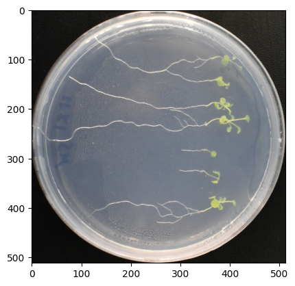
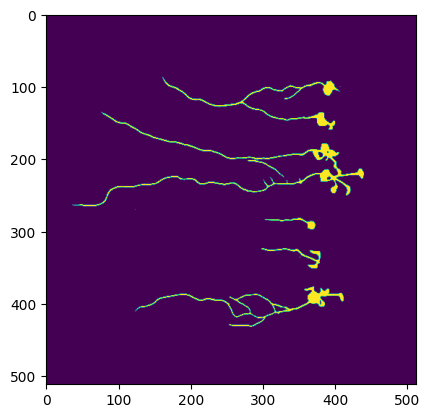
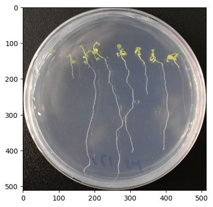
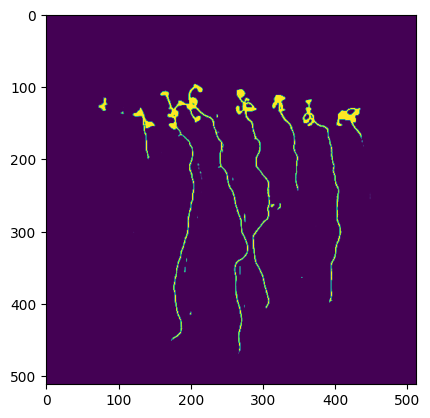
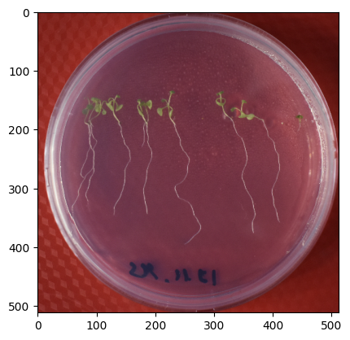
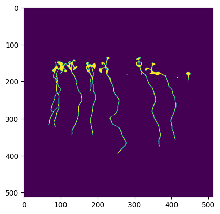

# SWWH
# Root Segmentation Project
# TensorFlow solution

## Project Overview
The Root Segmentation Project aims to leverage deep learning techniques, specifically a custom U-Net architecture, for the segmentation of root structures in images. This project is vital for understanding root growth patterns, aiding in agricultural research and environmental studies.

## Features
- Custom U-Net model implemented in TensorFlow.
- Integration with Albumentations for advanced image augmentations.
- Utilization of `segmentation_models` for efficient segmentation tasks.
- Data pipeline implementation for streamlined data processing and augmentation.

## Model Architecture
The model is a U-Net architecture, known for its efficiency in image segmentation tasks. It includes an encoder-decoder structure with skip connections to capture both high and low-level image features.

### Custom U-Net Components
- **Encoder**: Reduces the spatial dimensions while increasing the depth.
- **Decoder**: Recovers the spatial dimensions and depth, integrating features from the encoder via skip connections.
- **Output**: Generates the segmented image with a sigmoid activation function.

## Installation

Before running the project, ensure the following dependencies are installed:
```bash
pip install tensorflow numpy albumentations segmentation-models matplotlib opencv-python-headless wandb
```
## Dataset

The dataset consists of high-resolution images of root structures. The `DatasetCreator` class in `datapipeline.py` is used to preprocess and augment the images for training.

## Training

Training details:
- TensorFlow as the backend.
- Custom callbacks for monitoring and logging.
- Wandb integration for experiment tracking.

## Results

Below are some sample segmentation results produced by the model:

| Original Image | Segmented Image |
| --- | --- |
|  |  |
 --- | --- |
|  |  |
 --- | --- |
|  |  |